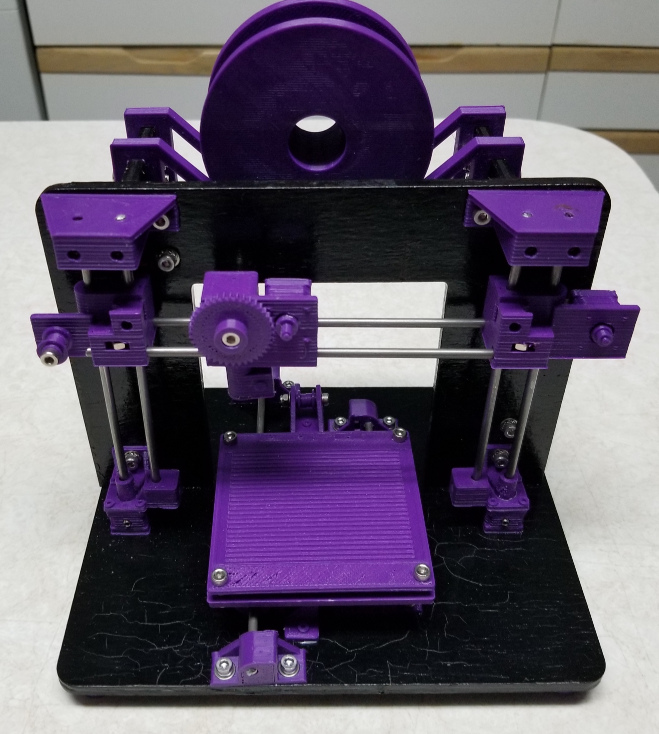
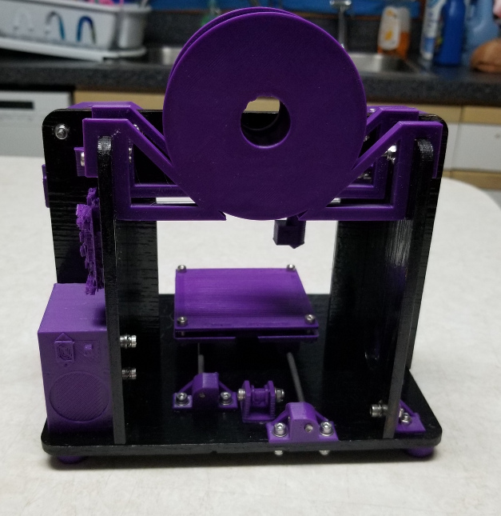

# ToyRap
Toy / Model 3D Printer based on the Mendel 90

Pre-rendered stl and 3mf files are available at [Thingiverse](https://www.thingiverse.com/thing:4025003)

[Why](http://unforgettability.net/content/page/blog_190214/) did I make this?

Directions coming soon (I hope) 
Meanwhile see bom.html for a bill of materials, both printed and vitamins.

Based on the [Mendel90](https://reprap.org/wiki/Mendel90). Thank you [Nophead](http://hydraraptor.blogspot.com/)!
